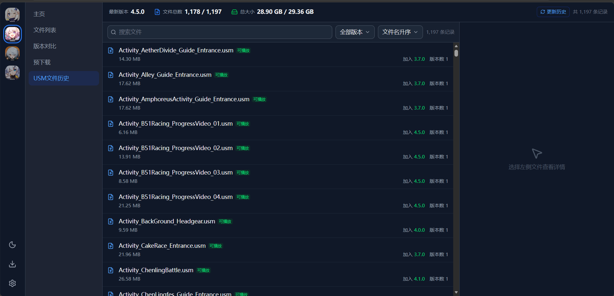

> 本项目由 DeepSeek V4.1 Flash 与 GLM 5.3 Flash 共同完成。
>
> 本项目基于原项目 [orilights/hoyo-files](https://github.com/orilights/hoyo-files) 二次开发，在此致谢。

<div align="center">  
  <h1>Hoyo Files</h1>  
  <p>米哈游游戏资源浏览器 · USM 过场动画在线播放与导出</p>  
</div>



---

## ⭐ 三款游戏历史 USM 视频密钥覆盖

统计口径：各游戏 `pkg_version/usm/{game}_history.json` 中**出现过的全部** USM 文件名  
（含已被新版本从游戏目录删除的文件），与 `{game}_keys.json` 逐一比对。

| 游戏         | 视频总数     | 已有密钥     | 密钥覆盖      |
| ---------- | -------- | -------- | --------- |
| 原神 CN      | 343      | 343      | **100%**  |
| 崩坏：星穹铁道 CN | 1197     | 1188     | 99.2%     |
| 绝区零 CN     | 2591     | 2584     | 99.7%     |
| **合计**     | **4131** | **4115** | **99.6%** |

> 绝区零的 history 按路径记录，共 2635 条 `.usm` 记录；其中 41 个文件名在多个目录中  
> 重复出现（同一视频的多份副本），密钥按文件名共享，故上表按唯一文件名计为 2591 个。

### 尚缺密钥的文件（共 16 个）


**崩坏：星穹铁道 CN（9 个）**

| 文件名                        | 可下载版本 | 大小      |
| -------------------------- | ----- | ------- |
| `CS_Activity_FateRin_CN_f` | 4.4.0 | 39.4 MB |
| `CS_Activity_FateRin_CN_m` | 4.4.0 | 39.5 MB |
| `CS_Activity_FateRin_EN_f` | 4.4.0 | 38.3 MB |
| `CS_Activity_FateRin_EN_m` | 4.4.0 | 39.4 MB |
| `CS_Activity_FateRin_JP_f` | 4.4.0 | 39.4 MB |
| `CS_Activity_FateRin_JP_m` | 4.4.0 | 39.4 MB |
| `CS_Activity_FateRin_KR_f` | 4.4.0 | 38.3 MB |
| `CS_Activity_FateRin_KR_m` | 4.4.0 | 39.5 MB |
| `CS_ChapLoop04_Act0330`    | 3.1.0 | 8.6 MB  |

**绝区零 CN（7 个）**

| 文件名                                                          | 可下载版本 | 大小      |
| ------------------------------------------------------------ | ----- | ------- |
| `HelloCar_Daily`                                             | 1.0.0 | 4.4 MB  |
| `HelloCar_Urgent`                                            | 1.0.0 | 2.1 MB  |
| `HelloCar_Weekly`                                            | 1.0.0 | 1.8 MB  |
| `ManualQTEDialog_AutoMode`                                   | 1.1.0 | 5.8 MB  |
| `ManualQTEDialog_ManualMode`                                 | 1.1.0 | 7.1 MB  |
| `SkyscraperThickFog.usm`（原文件名即 `SkyscraperThickFog.usm.usm`） | 1.0.0 | 17.9 MB |
| `Tutorial_Hakoba_1100117`                                    | 2.0.0 | 1.4 MB  |

---

## 项目说明

米哈游相关游戏资源包与文件列表查看工具，同时是一个 **USM 过场视频的在线播放/导出前端**。

- 数据来源：官方 CDN 的版本清单 + chunk 索引，可离线镜像到本地 `pkg_version/`
- 视频播放：浏览器端 wasm / 服务器端 Node 双路径，支持 VP9（WebM 流式）与 H.264（MP4/MKV）
- 密钥库：内置三款游戏 **4287** 条视频密钥，随仓库分发

## 支持游戏

| 游戏         | 文件列表      | USM 播放 | USM 导出                 |
| ---------- | --------- | ------ | ---------------------- |
| 原神 CN      | ✅         | ✅      | ✅ MKV（含 HCA 音轨）        |
| 崩坏：星穹铁道 CN | ✅（不支持语音包） | ✅      | ✅ H.264→MP4 / VP9→WebM |
| 绝区零 CN     | ✅         | ✅      | ✅ WebM（USM 内无音轨）       |
| 崩坏3 CN     | ⚠️ 历史数据不全 | —      | —                      |

## 功能列表

**文件与版本**

- 文件列表：游戏包 / 更新包 / 游戏文件 / 语音包，Chunk 信息查看
- 下载：直链下载、Chunk 下载、Manifest 导出（JSON）
- 版本对比：任选两个版本对比文件差异
- 预下载：查看与下载预下载差异包，支持按目录浏览

**USM 视频**

- USM 文件历史：查看全部版本的 USM 变更记录（新增 / 修改 / 删除）
- 指定版本下载：把历史版本的 USM 取回本地
- 在线播放：VP9 走 wasm + MSE 流式播放，H.264 走服务器转封装
- 导出：原神 → MKV（含音轨，可选语言通道）；崩铁 → MP4 / 带音轨 MKV；绝区零 → WebM

**其它**

- 亮色 / 暗色主题、移动端适配

## 快速开始

### 环境要求

- Node.js 18+ 与 pnpm
- ffmpeg（可选，USM 导出需要）

### 启动

```cmd
pnpm install        :: 首次使用
双击 start.cmd      :: 启动数据服务器 (8787) + 前端 (8600)
```

完成后访问 **http://127.0.0.1:8600**。停止服务双击 `stop.cmd`。

运行日志：根目录 `server.log` / `server.err.log` / `web.log`。

### 数据目录

数据仓库在仓库根目录的 `pkg_version/`（版本清单、chunk 索引、USM 历史与密钥），  
由数据服务器静态托管。修改位置见 `server/server.mjs` 的 `--data` 参数。

数据服务器默认只监听 `127.0.0.1:8787`，不对外网卡开放（因为它可经 `game_dir` 参数  
读取本机游戏文件）。如需局域网访问，用 `--host 0.0.0.0` 显式开启。

### 游戏目录

USM 播放/导出/格式探测会优先读取本地游戏文件（本地文件通常比 CDN 基线新，密钥只对本地  
版本有效），找不到才回退到直链与 chunk 组装。

游戏根目录按以下优先级确定（由高到低）：

1. 网站「设置 → 数据管理」里填写的路径（存在浏览器 localStorage，仅本机本浏览器生效）
2. 环境变量 `HK4E_GAME_DIR` / `HSR_GAME_DIR` / `NAP_GAME_DIR`
3. `server/server.mjs` 中 `GAME_DIRS` 的默认值

> 路径要填 **含 `*_Data` 文件夹的那一层**，例如 `D:/Games/ZenlessZoneZero Game`。  
> 填成 `.../ZenlessZoneZero_Data` 会找不到文件而静默回退到 CDN。

### 数据更新

数据仓库（`pkg_version/`）随仓库分发，已包含三款游戏当前版本的完整清单与密钥。  
游戏更新后，在网站「设置 → 数据管理」点对应游戏的「刷新」即可拉取最新版本数据  
（启动器凭据 → 预下载差异 → 文件清单），无需命令行。

预下载差异数据如需用外部工具单独生成，见 `server/README.md`。

### 设置 → 数据管理

本地运行时，网站「设置 → 数据管理」面板可直接维护数据仓库（`pkg_version/`）：

| 功能     | 说明                                                                                       |
| ------ | ---------------------------------------------------------------------------------------- |
| 数据状态   | 显示每个游戏的版本数、最新版本与预下载版本                                                                    |
| 刷新     | 调用官方接口更新该游戏的版本清单、chunk 快照与预下载差异数据                                                        |
| 游戏安装路径 | 填游戏根目录（含 `*_Data` 那一层），可点「浏览」调出系统文件夹选择框。预下载「修改文件」增量补丁需要读取游戏原文件；USM 播放/导出/格式探测也会优先用它读本地视频 |
| 刷新状态   | 重新读取本地数据仓库状态                                                                             |

「浏览」按钮由本地数据服务器调用系统对话框实现，仅在 Windows + 本地服务器下可用；  
纯静态部署时该按钮会提示不可用，路径仍可手动填写（但静态部署下 USM 只能走 CDN/chunk）。

「预下载」页面另提供差异包的浏览与下载；纯静态部署没有本地数据服务器，该面板不可用。

## 项目结构

```
├─ src/                  前端（Vue3 + Vite + Pinia + Tailwind）
│  ├─ views/             UsmHistory / FileList / VersionDiff / Predownload ...
│  ├─ utils/             usm_demux / h264mux / mkvmux / adx_decoder（前后端共用）
│  └─ constants/core.ts  GameList 游戏配置
├─ server/               数据服务器（Node，零依赖）
│  ├─ server.mjs         HTTP 服务：静态托管 + /api/usm-* 端点
│  └─ refresh.mjs        版本刷新 / chunk 组装 / USM 播放与导出
├─ pkg_version/          数据仓库（版本清单 / chunk / USM 历史与密钥）
├─ start.cmd / stop.cmd  一键启动 / 停止
└─ scripts/              辅助脚本（H.264 封装测试等）
```

## 常见问题

**播放按钮不显示？**  
说明该文件在当前版本密钥库中无对应 key。检查 `pkg_version/usm/{game}_keys.json`  
是否为合法 JSON，以及文件名（不含 `.usm`）是否在库中。

**播放失败 / 黑屏？**  
多为本地游戏文件版本与密钥不匹配（游戏热更后密钥可能变化）。可在「设置 → 数据管理」  
点一次「刷新」更新数据，并确认游戏安装路径填的是含 `*_Data` 的那一层。

**端口被占用（EACCES: permission denied）？**  
Windows 保留端口范围所致。查看排除范围：  
`netsh interface ipv4 show excludedportrange protocol=tcp`，改用其他端口即可。

**想新增游戏？**  
前端 `src/constants/core.ts` 的 `GameList` 与 `server/refresh.mjs` 的 `GAMES`  
各加一条，然后在网站「设置 → 数据管理」点一次刷新。

## Credits

USM 视频密钥库参考了以下项目的工作，在此致谢：

- 原神 — [ToaHartor/GI-cutscenes](https://github.com/ToaHartor/GI-cutscenes)；  
  密钥提取使用的已知明文攻击工具为 [anon658264test7294/usmcrack](https://github.com/anon658264test7294/usmcrack)（MIT）
- 崩坏：星穹铁道 — [im-remi/HSRGlobalMetadata](https://github.com/im-remi/HSRGlobalMetadata)，据此进行逆向
- 绝区零 — [dimbreath/ZenlessData](https://git.mero.moe/dimbreath/ZenlessData) 的数据

## 免责声明

本项目仅用于技术研究与学习交流。所有游戏资源版权归米哈游所有，  
请勿将解密内容用于商业用途或二次分发。
